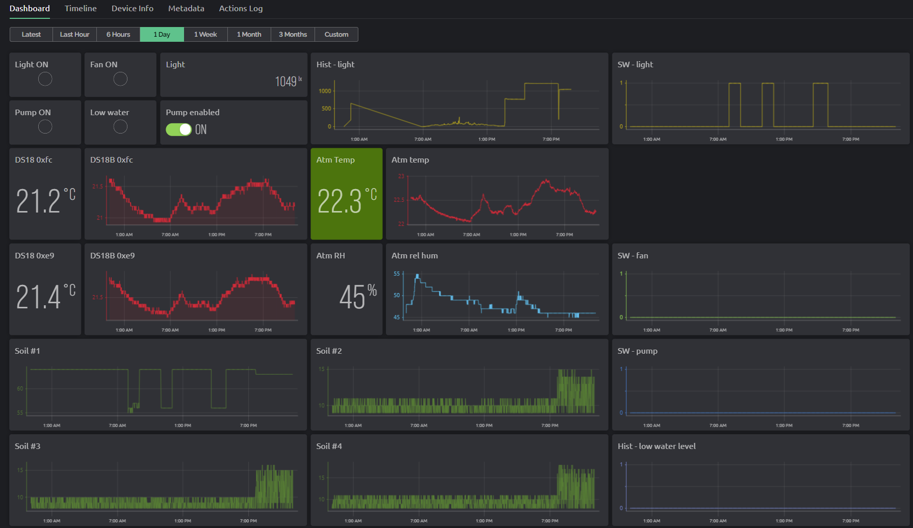

# Flora env monitor

## Intro

Code for ESP32-based device which measures physical properties of plant's environment and reports the data into cloud which presents them as a dashboard.
As this is a hobby-level project, it's based on MicroPython, commonly available I2C components with *good-enough* accuracy, and a public free-level IoT cloud service.

### Features

**Measured properties:**

- soil temperature (2x DS18B)
- soil humidity (4x capacity sensors)
- light intensity (BH1750)
- atmospheric temperature and humidity (SHT3X)
- water level in a tank (binary tilt sensor)

**Peripherals controlled via relay board:**

- water pump
  - if there is a sufficient water level  
    and soil humidity is too low  
    turn on the water pump
  - pump can be turned off permanently via cloud dashboard
  - pump setting is fetched every `T_NETWORK_UPDATE` seconds (default=60s)
- fan
  - if atmospheric humidity crosses threshold  
    turn on a fan
- light
  - turn light on/off based on pre-configured schedule

**Communication with user:**

- 128x64 OLED display
  - reporting status of sensors and connectivity in periodic intervals
- IoT cloud / dashboard running on [Blynk.cloud](https://blynk.cloud/)

**Misc:**

- RTC sync via NTP when connected to WiFi
- UTC offset set manually by user per timezone. DST supported!
- automatic reboot when WiFi connection fails `RECONN_ATTEMPT`-times
- Cloud update failure automatically triggers WiFi reconnection attempt
- should work also in case of a peripheral failure
  - i.e. failure to read atmospheric data should not impact soil measurement
  - the only exception is the I2C bus. If it fails to init, the whole application halts

## Installation

1. Grab a fresh [MicroPython binary](https://micropython.org/download/esp32/)
2. Flash it. ... possibly via [esptool](https://docs.espressif.com/projects/esptool/en/latest/esp32/esptool/basic-commands.html)
3. Copy content of the `src` folder into the ESP32 root

## Configuration

Most if not all configuration is located in `config.py`
Possibly most important user variables:

- `TIMEZONE_UTC_OFFSET` - specify timezone of the device
- `TRG_LIGHT` - list of tuples with start and end time when light is supposed to turn on
- `TRG_SOIL` - % threshold value for soil humidity when water pump relay turns on
- `TRG_ATM` - % threshold value for atmospheric humidity when fan relay turns on
- `BLYNK_TOKEN` - private API key for the Blynk.cloud
- `NETWORKS` - dictionary of "SSID":"password" key-value pairs

## Related documentation

- [schematics](./docs/schema.png)
- [PCB layout](./docs/pcb.png)
- making of [photo gallery](https://imgur.com/a/EjbX96v)

**Dashboard demo:**

## FAQ / Sidenotes

**Q:** There are 4 soil humidity sensors. How is decided if the pump should start?  
**A:** All non-zero measurements are averaged. The pump starts ff the average value is above threshold.

**Q:** Need to disconnect soil sensor and ensure it won't affect rest of measurement.  
**A:** Ground the "signal" terminal to force the analog channel into zero.

**Q:** Need to disconnect a water level sensor and ensure the pump won't start.  
**A:** Leave the terminal open. Open terminal, low water indication => pump won't start.

**Q:** Soil humidity measurements are weird?  
**A:** Output value is affected by probe insertion depth and how tight the soil packed around it is. More details available [here](https://lastminuteengineers.com/capacitive-soil-moisture-sensor-arduino/)

If you ever need to replace a capacitance soil sensor:

- verify the 1M pull-down resistor is not interrupted by wrongly placed via .. [details](https://www.reddit.com/r/arduino/comments/q1anwt/beware_of_faulty_capacitive_soil_moisture_sensors/)  
- some sensors are missing linear voltage regulator or have NE555, therefore does not support 3.3V logic. This issue should not apply to this project as we're using 5V logic and external ADS1115 ADC.  
  - details:
    - [Capacitive Soil Moisture Sensors don't work correctly](https://www.youtube.com/watch?v=IGP38bz-K48)  
    - [Building Wireless Soil Moisture Sensors With Custom PCB](https://www.bennettnotes.com/projects/building-wireless-soil-sensors-with-pcb/)